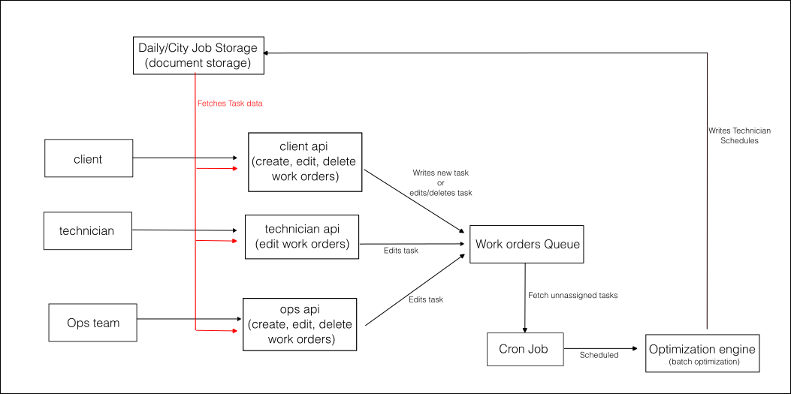

# SFR3Challange

## SFR3 Maintenance Work Order Scheduler
This project is a proof-of-concept optimization engine that assigns daily work orders to a fleet of mobile handymen (“Property Engineers”) operating across metropolitan areas, inspired by real-world operations at SFR3.

The engine handles scheduling under multiple constraints (e.g. skills, travel time, job priority) and re-optimizes automatically whenever jobs or assignments change.

## Problem Formulation
### Decision Variables

- Assignment of each job to a technician.

- Order of jobs in each technician's schedule.

### Objectives

- Minimize total travel distance.

- Prefer skill-aligned job assignments.

- Prioritize urgent jobs.

- Keep technician workloads balanced and efficient, under their work schedules.

### Constraints

- Jobs require specific skillsets.

- Technicians have limited capacity per day (hours or work).

- Jobs have to be assigned within working hours (e.g., 9 AM–5 PM SLA)

- Jobs may have a priority level or soft time window.

- Jobs have spacing in between (technician transportation).

## Approach & Modeling
This tool models the problem as a priority and skill-constrained VRP (Vehicle Routing Problem), with real-time reoptimization.

### Techniques Used

- Local search heuristic (nearest neightbor) for initial solution.

- This is an assignation problem that could be solved using MILP

- A more elaborated solution could include clustering to split the city in work areas and simplify the area routing (cluster first-route second)

### Data Needed
- Tasks: Location, Type (required skill), Estimated Duration, Priority, Rescheduling Cost

- Technician: Skill, Availability (in hours), Location, Rating

## System & Strategy
- The Optimization compute depends on how frequent new taks arrive, if they are infrequent we might do it on-demand, if frequent we should set a cron job and a task queue because on-demand optimization(event-driven) leads to sub-optimal desicion making in this conditions

- Depending on the Task state, a job with changed duration should be reoptimized again to assign it more properly, if the job is done we keep it in the position it has in the schedule, so the following jobs get automatically updated

- Canceled Jobs also trigger re-optimizations so the void they left can be filled

- Other Uncertainities should be included in the Task estimated time and the Travel Times Between Jobs

- Solution Quality can be evaluated using the idle time operators have, the job distribution among technicians, the throughput, the ranking of the tasks perfomed (by prority), The ammount of jobs assigned, how long top priorities take, the cost of the routes, we could also use user task rating 

## Monitoring
- Logs problem statement (unnasigned jobs, technicians), scheduling decisions and time taken.

- Tracks job modification (success/failures, lateness, reassignment)

- Tracks technician progress within the schedule

## System Architecture

- Scheduling Service: Core optimization logic.

- Worker Mobile App: Receives daily jobs, logs progress.

- Client Mobile App: Creates, Deletes or updates jobs.

- Internal Ops Dashboard: For overrides, monitoring, job creation.

- Data APIs: Sync with property/job management systems.

- Monitoring Layer: Track KPIs like job lateness, reassignment rate, travel time.

## Clients & Interfaces
- Who are the clients of this system? (e.g., internal ops teams, mobile apps for Property Engineers)
- What mechanisms allow feedback or overrides to flow back into the system?

## Clients & Interfaces
### Clients:

- Internal Ops Team

- Property Engineers (technicians)

- External job creation sources (e.g., client platforms)

### Interfaces:

- Internal Dashboard: For manual overrides, visual job timelines.

- Technician App: Receives job schedule and allows status updates.

- Client Portal/API: Allows job creation, updates, and feedback.

###  Feedback Loops:

- Technician job feedback can update estimated duration or skill mapping.

- Ops dashboard can manually reassign or reprioritize jobs.

## Data Flow
- Jobs are created via Client or Ops API.

- Stored in document DB (DailyCityJobStorage).

- Added to the Work Orders Queue.

- Cron job or event listener triggers Optimization Engine.

- Updated schedule pushed back to DB.

- Technicians pull schedule updates via API.

## Persistent Data Stores
- Technician Profiles (skills, ratings, availability) in relational DB or document storage

- Day Jobs and Schedules in Document Storage (MongoDB)

- Unnasigned Jobs in relational DB or document storage

- Job History (completed jobs, durations, client ratings) (kibana)

- Optimization logs like compute time and RAM used (kibana)

## Resilience
- All job updates and assignments are versioned and stored (kibana).

- Queue-based optimization ensures retries and failure recovery.

- System allows fallback to manual overrides.

### Cost function integrates:

- Travel distance

- Skill mismatch penalty

- SLA Limit

- Priority/job importance weighting

### Reoptimization triggered on:

- Job creation, deletion or update

- Assignment changes

## Features
- Interactive visual schedule (HTML canvas)

- Add, edit, delete jobs (assigned or unassigned)

- Automatic reoptimization on every change

- Technicians visually mapped to their routes

- Prioritized job scheduling

- SLA enforced (technician cannot take jobs after 5 p.m.)

## Evaluation Metrics (for production)
- Average job travel distance

- % of skill-matched jobs

- Throughtput

- Assignation Variance

- Technician idle time

- Job lateness or missed SLAs

- Rescheduling cost

## Notes

While the problem has similarities to a Job-Shop Scheduling Problem (JSSP) in skill compatibility and priority handling, the geographic mobility of technicians and the dynamic, real-time nature of the task make it a better fit for a rich VRP variant.

This prototype is a fast, heuristic-based optimizer suitable for daily or semi-realtime field operations, for a MILP solver "branch and bound" should be implemented

Designed with extensibility in mind for future integration with backend job feeds and technician location data.
